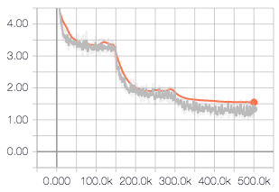
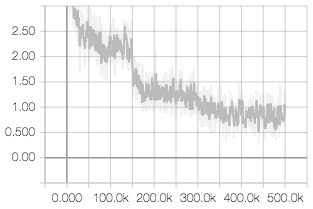
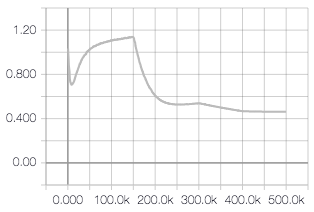
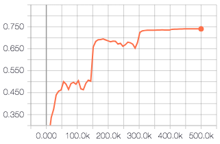

# Train ResNet-50 on ImageNet

We provide below the recipe to train a ResNet-50 [model](https://www.cv-foundation.org/openaccess/content_cvpr_2016/html/He_Deep_Residual_Learning_CVPR_2016_paper.html) on the ImageNet dataset and achieve 74.05% single crop accuracy on the validation set. This recipe was based on models that were previously trained in [TensorFlow](https://github.com/tensorflow/models/tree/master/official/resnet) and [Caffe](https://github.com/KaimingHe/deep-residual-networks).

## Data

### Raw data

#### Description

The ImageNet dataset contains ~14M images that are classified into ~21K categories from the WordNet hierarchy. The classification task in the ImageNet Large Scale Visual Recognition Competition (ILSVRC) uses a subset of 1000 categories with ~1M associated images for training. Each image has a single label associated, and a bounding box with the object location may be available.

#### Path
Information on how to download ImageNet can be found on the dataset [website](http://image-net.org/). You need to sign up for an account in order to access the data. 

### Data Processing Methods

#### Description

Images are downloaded and processed into the TFRecord format. The training data is sharded into 1024 training files with names `train-0????-of-01024` and 128 validation files with names `validation-0????-of-00128`. The classes are randomly distributed within each file. Data processing may take up to half a day. 

#### Code
We follow the data processing methods from the Inception [guide](https://github.com/tensorflow/models/tree/master/research/inception#getting-started). We ran the code using commit `bd56a06d2815e3dc2914fc8ce2fa1ea60e19d324`. 

#### Path
The processed data can be found in HDFS at `hdfs:/projects/ml/data/imagenet_bbox`. Contact the author for permissions and access.

## Training

### Optimization Methods

#### Description
We use the ResNet-50 architecture and the softmax loss. 

#### Code
We ran our experiments using git commit `24b236fdb6ca449eb52e8f816e039e0d634015a5`. The code is written using TensorFlow and uses its high level [APIs](https://www.tensorflow.org/guide/estimators). After cloning the repository you can train the model by running

```
python train.py \
  --dataset_directory=/path/to/data \
  --output_directory=/path/to/output \
  --models_repository=/path/to/repo
```

where

* `dataset_directory` points to the training data. We expect a directory with the training and validation files with patterns `train-0????-of-01024` and `validation-0????-of-00128`.
* `output_directory` is the directory where model checkpoints and logs are written.
* `models_repository` points to the directory where you have cloned the TensorFlow models [repository](https://github.com/tensorflow/models) which contains the code to build the ResNet architecture. We use version `v1.10.0`. 

You can visualize the training by running TensorBoard `tensorboard --logdir /path/to/outputs`, where `logdir` points to the parent directory of `output_directory`. 

#### Hyperparameters

We use the following hyperparameters:

* Optimizer
    * Stochastic gradient descent (SGD) with momentum 0.9
    * Synchronized SGD across 4 GPUs
    * Batch size: 256, e.g. 64 per GPU
    * Learning rate starts at 0.1, decayed by a factor of 10 after 150000, 300000, 400000, and 450000 iterations
* Regularization
    * Weight decay: 0.0001
* Data augmentation
    * crop a distorted bounding box around the object (see [code](preprocess.py\#L59-L66) for details).
    * randomly flip the image left to right
    * resize the image to 224 x 224 x 3
    * subtract mean value in R, G, B channels (see [code](preprocess.py\#L59-L66) for values). 

#### Dynamics
Training takes ~24 hours. You can visualize below the evolution of the total, cross-entropy, and l2 losses.





#### Outputs

The model checkpoints and TensorFlow logs can be found on HDFS at `hdfs://projects/ml/recipe/resnet50_imagenet`. 

### Performance metrics

#### Target metrics

During evaluation we resize the image such that the minimum edge, and run inference using the 224 x 224 x 3 center crop. The top-1 single crop accuracy is 74.0% after 500K iterations.

#### Code

The accuracy is computed by the training script automatically. It can be read using TensorBoard as shown below.



## Inference

#### Code
We provide a [notebook](inference.ipynb) that provides an example of how to run inference on sample images. 

#### Timing information
We measure the model latency using the inference notebook. We used a p3.2xlarge instance on AWS which has an NVIDIA GPU V100. The latency including preprocessing is 11ms with a batch size of 1. Note that the inference code doesn't run on a CPU because the channel ordering is NCHW and the max pooling operation only supports NHWC on a CPU device. We use TensorFlow v1.8. 

#### Serialization 
Not applicable. The model was trained for research purposes and is not deployed to production.

## Miscellaneous

* Performance is 2\% below published results. We plan on running the training code from the TensorFlow models repository to determine whether there is a discrepancy in the code or in the training data
* Using 8 GPUs did not increase the throughput. It is worth determining the bottleneck in the data pipeline in order to further parallelize the code and decrease the training time. The Stanford DAWN Deep Learning [Benchmark](https://dawn.cs.stanford.edu/benchmark/) provides relevant pointers regarding state-of-the-art training times for ImageNet.
